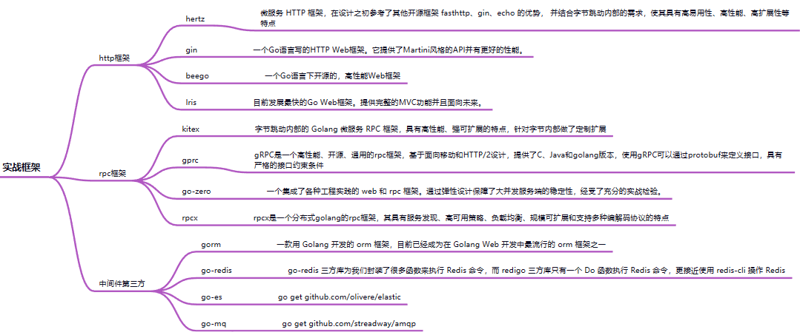

# GoLearn

Go学习

## 环境  💻

- IDE编译器 GoLand

## 参考 👀

-  [Go网址导航](https://hao.studygolang.com/)
-  [Go系列教程（Golang tutorial series）](https://studygolang.com/subject/2)
-  kuangstudy
-  [Go语言中文网️](https://studygolang.com/)
-  [菜鸟教程](https://www.runoob.com/go/go-tutorial.html)
-  [Go 语言简明教程](https://geektutu.com/post/quick-golang.html)

## 框架 

- web
  -  [Gin Web Framework](https://gin-gonic.com/zh-cn/docs/examples/bind-single-binary-with-template/)
  -  [Iris](https://www.iris-go.com/docs/#/?id=quick-start)
  -  [BeeGo](https://beego.gocn.vip/beego/zh/)

- orm
  - [sqlx](https://jmoiron.github.io/sqlx/) | [github](https://github.com/jmoiron/sqlx)
  - [xorm](https://xorm.io/zh/) | [github](https://github.com/go-xorm/xorm)
  - [gorm](https://gorm.io/zh_CN/)

- rpc
  -  [grpc](https://grpc.io/docs/) | [grpc中文文档](https://doc.oschina.net/grpc?t=60133)

- [go-zero](https://go-zero.dev/)
