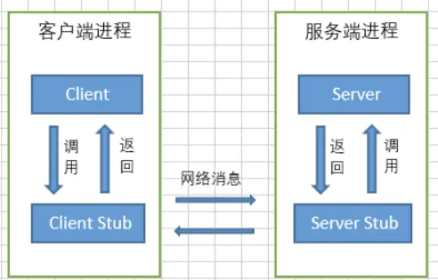

RPC是远程过程调用（Remote Procedure Call）的缩写形式，是分布式系统中不同节点间流行的通信方式。

一个完整的RPC架构里面包含了四个核心的组件，分别是Client ,Server,Client Stub以及Server Stub，这个Stub大家可以理解为存根。分别说说这几个组件：

- 客户端（Client），服务的调用方。
- 服务端（Server），真正的服务提供者。
- 客户端存根，存放服务端的地址消息，再将客户端的请求参数打包成网络消息，然后通过网络远程发送给服务方。
- 服务端存根，接收客户端发送过来的消息，将消息解包，并调用本地的方法。

